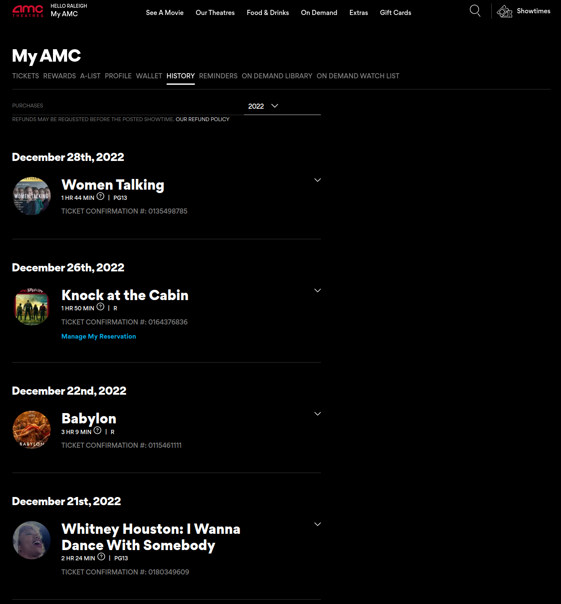
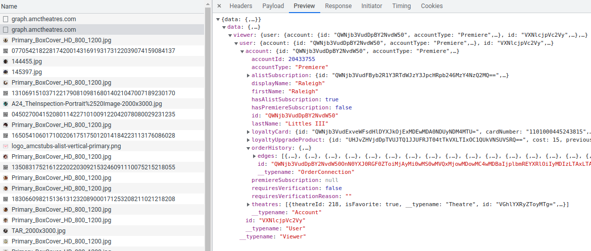
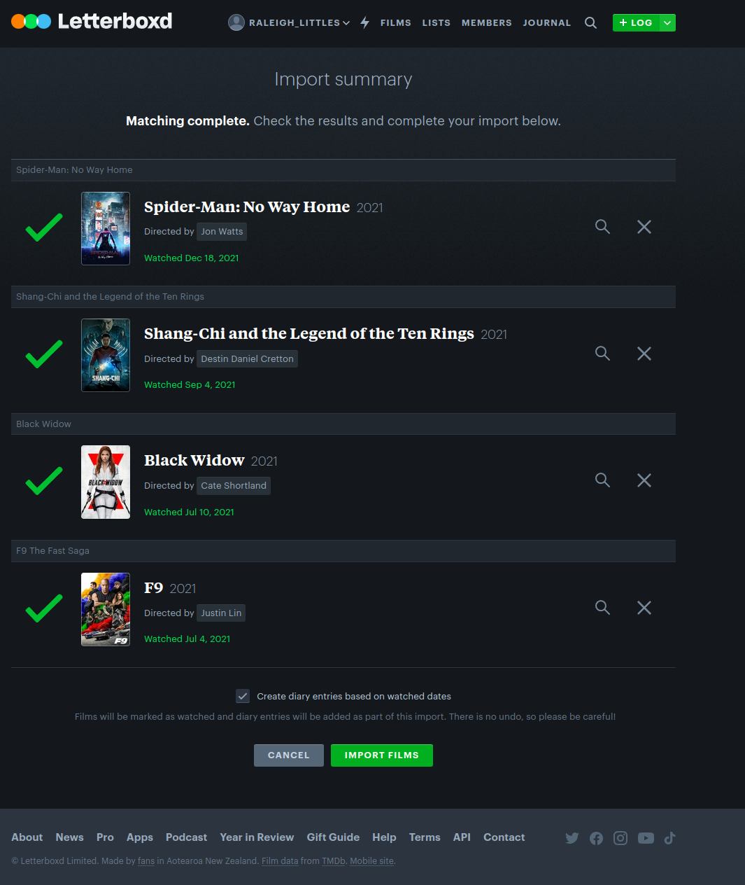
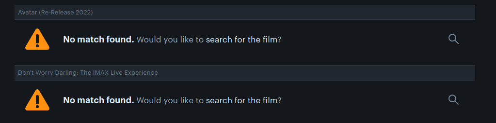

# About

This tool extracts your AMC order history into a CSV file, so that you can upload it into [Letterboxd](https://letterboxd.com/), a popular film-sharing website.

# Usage

## Step 1: AMC Order History

Start by going to your AMC order history. This requires you to have an AMC account.

If you're an AMC stubs member (like me), you can go to https://www.amctheatres.com/amcstubs/history

But if you're not an AMC stubs member, the URL will be different -- but regardless, it should look like this:



## Step 2: Open Developer Tools

Open up the "Developer Tools" window of whatever browser you're using. (On Chrome, the shortcut key is F12.)

Go to the "Network" tab.

## Step 3: Select your reporting interval

Using the dropdown (right across from "Purchases"), choose the time window that you want to extract order history for. Right now the options are:

* Past 30 days
* Past 60 days
* Past 90 days

AMC seems to store history only for up to the past 2 years.

## Step 4: Copy transaction from log

After choosing the time window, you should see a request being made to `graph.amctheaters.com` (This is their OpenGraph (?) URL)

Click on it, then open the "Preview" window:



Right click on the `orderHistory` segment, then choose "Copy object" from the dropdown.

Paste it into a text file with your desired name.

## Step 5: Run this script

Run:

```bash
$ python3 amc_history_order_extractor.py -i <INPUT-FILE> -o <OUTPUT-CSV-FILE>
```

Where INPUT-FILE is the name of the file you created in the previous step, and OUTPUT-FILE is some arbitrarily named CSV file.

Make sure the script runs successfully. If you examine the CSV file you should see something like this:

```
Title,Watched Date,Theater,Ticket Cost
Women Talking,2022-12-30,AMC The Grove 14,0
Babylon,2022-12-24,AMC Burbank 16,0
Whitney Houston: I Wanna Dance With Somebody,2022-12-29,AMC Burbank 16,0
The Whale,2022-12-19,AMC Burbank 16,0
Avatar: The Way of Water,2022-12-17,Universal Cinema AMC at CityWalk Hollywood,0
Strange World,2022-12-05,AMC Burbank Town Center 8,0
```

(Remember, I have AMC A-List, so my tickets are 'free' :smile: )

## Step 6: Open Letterboxd and import your CSV file

Go to: https://letterboxd.com/import/

And choose "Select a file"

A file dialog will open, allowing you to choose the CSV file that was just created.

You'll be given a chance to review the movies before they're added to your account, so please do so.



If your ticket name didn't match the movie name, you'll have to enter it manually unfortunately. Here's an example of such showings:

* IMAX Live Experiences
* Re-releases
* Anniversary IMAX Release

